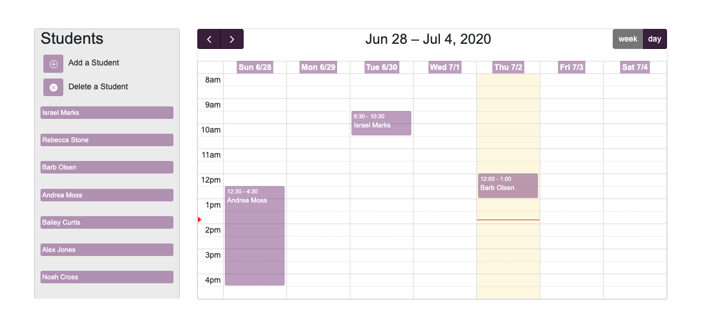

# Tutor Tracker

## Description

The Tutor Tracker is an easy to use Web Application for busy educators to organize student meetings.

## Table of Contents

* [Usage](#usage)

* [Technology](#Technology)

* [Questions](#questions)

## Usage

https://afternoon-eyrie-99732.herokuapp.com

This application allows teachers to add students to their list, drag and drop them to the interactive calendar and delete or reschedule as needed. When adding students a modal will appear to input the student information. The modal will also be a useful tool for updating currently scheduled students or deleting students from the calendar.

## Technology
Express-Handlebars, Express, Node.js, Sequelize, FullCalendar.io, Moment.js, Bootstrap, JQuery, Javascript, HTML, CSS

## Questions

Jessica Ringler | jrringler13759@gmail.com

James L DeLeonardis | jdeleonardis@hotmail.com

Elliot Rodgers | elliottarodgers@gmail.com

Mónica Polanco Fabián | MonicaPolancoFabian15@gmail.com
